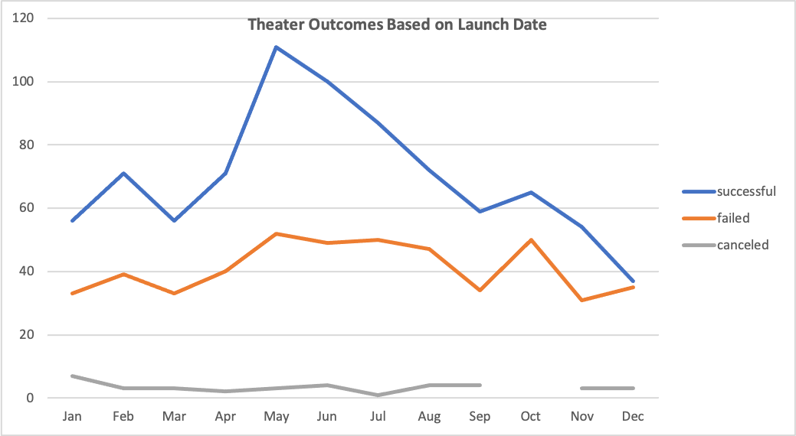
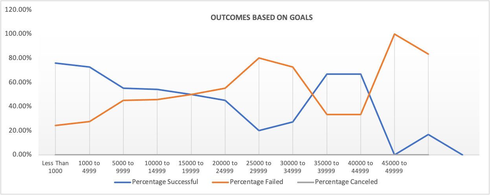

 An Analysis of Kickstarter Campaigns

Performing analysis on Kickstarter data to uncover trends.

1. Overview of the Project:  

Louise is interested in starting a compaign and not sure where to start, so she consulted with us to help her out. Her focus is on the theather. She can run a successful pledge campaign based on  historical data. Looking at a similar data, she can have a better grasp of what she can really expect or achieve. The goal is to provide her not only statistical numbers, but also visual depictions. 

2. Analysis and Challenges: 

Having a large set of data, created pivot tables to summarize data and to filter them. Adding visual representation along with pivot charts also shows the same information in a different way. Human beings are visual and either representing or consuming the same source of information from a variety of ways help the communication. Excel is one of the best tools to work with data to create summaries or visual aids.

3. Results: 

a. What are two conclusions you can draw about the Theater Outcomes by Launch Date?
   1. Month of May is the most successful month.
   2. Starting campaign goals at towards the end of Spring can get Louise a good headstart.

b. What can you conclude about the Outcomes based on Goals? 
Goals set between $1000 - $4999 is the most pledged amount or successful.

c. What are some limitations of this dataset? 
The number of records is only 4112. If we had a larger set of data, for example 10000, it could be interesting. A larger data set might reveal more details or trends.

d. What are some other possible tables and/or graphs that we could create? 
This can be as many applicable data options for any visualizations MS Excel offers and Louise would be intested in. After sharing the first draft, I would ask follow up questions to Louise and then look into additional visualizations.
